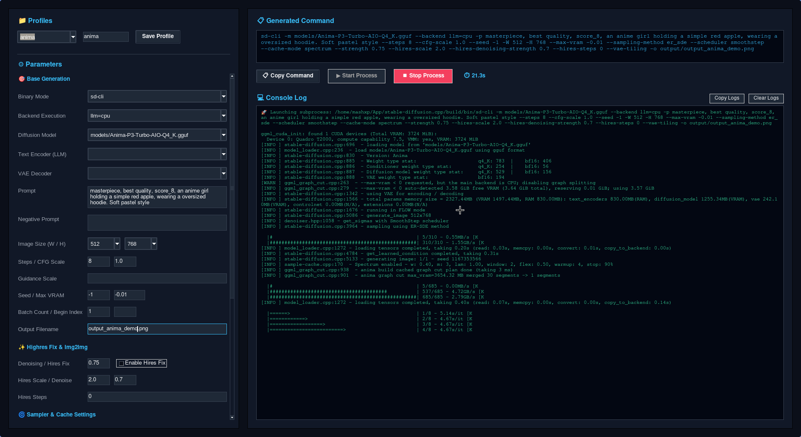
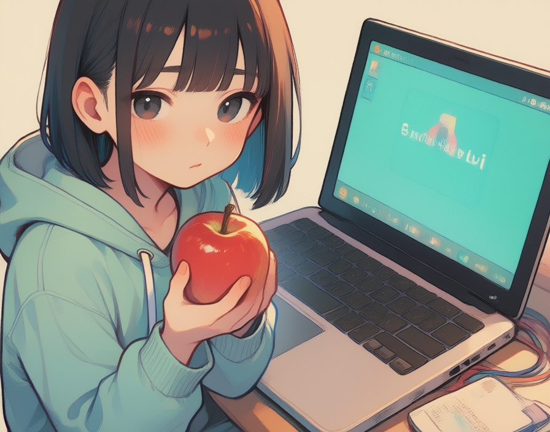

# SD-GUI: Tkinter Desktop Manager for stable-diffusion.cpp

A standalone Tkinter-based desktop interface to manage, configure, and execute `stable-diffusion.cpp` text-to-image processes.



## Requirements

1. **Python 3** with `tkinter` library.
2. **stable-diffusion.cpp** built binaries located in the default paths:
   - `~/App/stable-diffusion.cpp/build/bin/sd-cli`
   - `~/App/stable-diffusion.cpp/build/bin/sd-server`

## Directory Structure

- `src/`: Core Python files for UI styling, runner processes, and profile managers.
- `profiles/`: Environment configuration files (`*.env`) storing preset options (e.g. `anima.env`, `bonsai.env`).
- `models/`: Folder containing model weights (`.safetensors`, `.gguf`, `.ckpt`).
- `output/`: Folder where generated images are saved.

## Getting Started

1. **Place models**:
   Put your model files inside the `models/` directory. (You can also create symbolic links to your existing models).
   
2. **Configure profiles**:
   Save environment configuration presets as `.env` files in the `profiles/` directory.

3. **Launch the interface**:
   Run the launcher script from the repository root:
   ```bash
   python sd-gui.py
   ```

## Network Utility (`ip`)

The repository includes a helper script `ip` to quickly detect your machine's primary local network IP and generate a shareable URL to access and navigate to the running `sd-server` instance.

### Usage

Run the utility from the repository root:
```bash
./ip [port]
```

### Options / Arguments
- **`port`**: Optional port number to target (defaults to `1234`).
- **`-h`, `--help`**: Show usage information.

## Optimal Size Configs Reference

### 16:9 / 9:16 (Widescreen)
- 704 x 384 (or 384 x 704)
- 896 x 512 (or 512 x 896)
- 1024 x 576 (or 576 x 1024)

### 2:3 / 3:2 (Portrait / Landscape)
- 448 x 640 (or 640 x 448)
- 512 x 768 (or 768 x 512)
- 640 x 960 (or 960 x 640)

### 1:1 (Square)
- 448 x 448
- 512 x 512
- 768 x 768

## Credits & References

- **stable-diffusion.cpp**: A lightweight, pure C/C++ inference implementation for Stable Diffusion, developed by [leejet/stable-diffusion.cpp](https://github.com/leejet/stable-diffusion.cpp).
- **Anima Model**: A 2-billion-parameter text-to-image model optimized for anime illustrations, developed by [CircleStone Labs & Comfy Org](https://huggingface.co/circlestone-labs/Anima). Community GGUF format quantizations are hosted by [n-Arno/Anima-P3-Turbo-AIO-Q4_K](https://huggingface.co/n-Arno/Anima-P3-Turbo-AIO-Q4_K).



> A clickbaity image : )