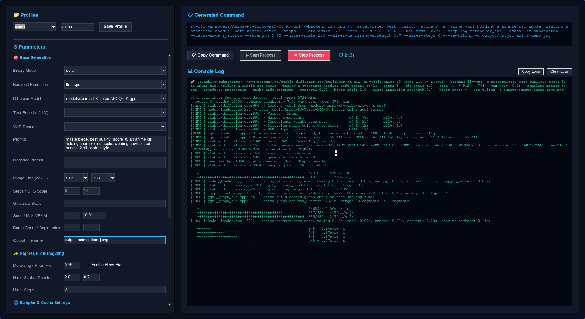
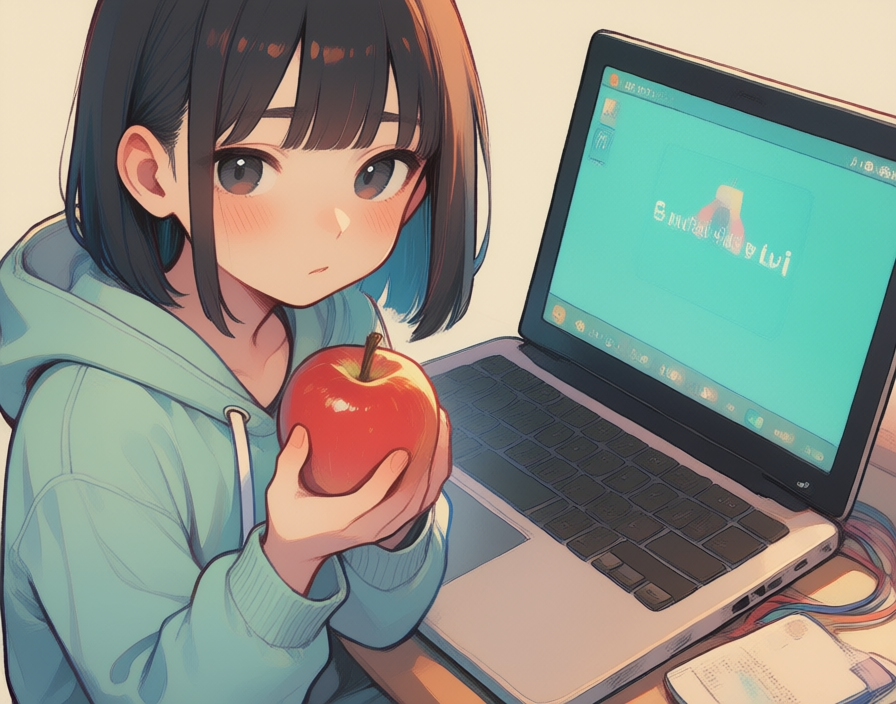

<p align="center">
  
</p>

# SD-GUI: Tkinter Desktop Manager for stable-diffusion.cpp

A standalone Tkinter-based desktop interface to manage, configure, and execute `stable-diffusion.cpp` processes — supporting text-to-image, image-to-image, video generation, inpainting, and model conversion.



## Features

- **Modular tabbed UI**: Generator, Gallery, Execution History, and Prompt Tag Helper tabs
- **Multiple generation modes**: txt2img, img2img, video generation (vid_gen), inpainting, model conversion
- **T5XXL & LLM text encoder support**: Select separate model paths for text encoders
- **VAE control**: Choose custom VAE decoders, toggle VAE tiling and direct convolution
- **Video generation**: Flow shift and frame count settings for vid_gen mode
- **Collapsible parameter groups**: Organized accordion sections for img2img/hires-fix, sampler/scheduler settings, and advanced performance options
- **Output preview**: Live preview of the last generated image with Open File / Open Folder buttons
- **Prompt Tag Helper**: Categorized chip tags (art styles, lighting, camera, quality) that append to your prompt
- **Execution History**: SQLite-backed persistent history with double-click to reload any past run's parameters
- **Gallery**: Thumbnail grid of all generated outputs with file opening support
- **Profile system**: Save and load `.env` configuration presets
- **Live command preview**: See the full CLI command before running
- **Wayland-safe clipboard**: Ctrl+C/X uses `wl-copy` with process isolation to avoid XWayland SIGSEGV crashes
- **Desktop integration**: `.desktop` file for Linux launcher support

## Requirements

1. **Python 3** with `tkinter` library.
2. **stable-diffusion.cpp** built binaries in one of:
   - `~/App/stable-diffusion.cpp/build/bin/sd-cli`
   - `~/App/stable-diffusion.cpp/build/bin/sd-server`
3. **(Linux/Wayland only)** `wl-clipboard` package for clipboard operations:
   ```bash
   # Debian/Ubuntu
   sudo apt install wl-clipboard
   # Arch
   sudo pacman -S wl-clipboard
   # Fedora
   sudo dnf install wl-clipboard
   ```

## Directory Structure

- `src/` — Core Python files
  - `app.py` — Main application window and tab management
  - `runner.py` — Subprocess management for sd-cli/sd-server
  - `styles.py` — Theme, fonts, and UI styling
  - `history_db.py` — SQLite execution history database
  - `profile_manager.py` — Profile (.env) loading and saving
  - `ui/` — Modular tab classes
    - `tab_generator.py` — Generator tab (parameters, command preview, logs)
    - `tab_gallery.py` — Output gallery grid
    - `tab_history.py` — Execution history treeview
    - `tab_prompt_helper.py` — Prompt tag chip selector
    - `widgets.py` — Reusable UI components (CollapsibleFrame, etc.)
- `profiles/` — Environment configuration files (`*.env`) storing preset options
- `models/` — Folder containing model weights (`.safetensors`, `.gguf`, `.ckpt`)
- `output/` — Folder where generated images and videos are saved

## Getting Started

1. **Place models** in the `models/` directory (or symlink to existing models).
2. **Configure profiles** as `.env` files in the `profiles/` directory.
3. **Launch the interface**:
   ```bash
   python sd-gui.py
   ```

## Network Utility (`ip`)

The repository includes a helper script `ip` to quickly detect your machine's primary local network IP and generate a shareable URL for accessing a running `sd-server` instance.

```bash
./ip [port]
```

- **`port`**: Optional port number (defaults to `1234`).
- **`-h`, `--help`**: Show usage information.

## Optimal Size Configs Reference

### 16:9 / 9:16 (Widescreen)
- 704 x 384 (or 384 x 704)
- 896 x 512 (or 512 x 896)
- 1024 x 576 (or 576 x 1024)

### 2:3 / 3:2 (Portrait / Landscape)
- 448 x 640 (or 640 x 448)
- 512 x 768 (or 768 x 512)
- 640 x 960 (or 960 x 640)

### 1:1 (Square)
- 448 x 448
- 512 x 512
- 768 x 768

## Credits & References

- **stable-diffusion.cpp**: A lightweight, pure C/C++ inference implementation for Stable Diffusion, developed by [leejet/stable-diffusion.cpp](https://github.com/leejet/stable-diffusion.cpp).
- **Anima Model**: A 2-billion-parameter text-to-image model optimized for anime illustrations, developed by [CircleStone Labs & Comfy Org](https://huggingface.co/circlestone-labs/Anima). Community GGUF format quantizations are hosted by [n-Arno/Anima-P3-Turbo-AIO-Q4_K](https://huggingface.co/n-Arno/Anima-P3-Turbo-AIO-Q4_K).


